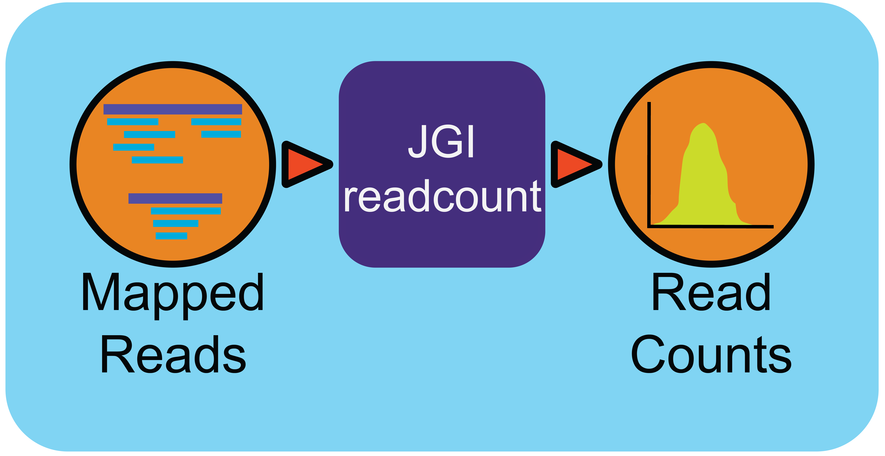

MetaT Read Counts Workflow (v0.0.5)
=============================

Workflow Overview
-----------------
This workflow generates tab separated read count files from BAM and GFF files. 
The repository is based off JGI's metatranscriptomic analysis package for transcriptomic reads and uses SAMTOOLS (1.15) in the pipeline `readCov_metaTranscriptome_2k20.pl`.

The script is called as such within the WDL.

.. code-block:: 
   readCov_metaTranscriptome_2k20.pl \
         -b ~{bam} \       # input BAM
         -m ~{map} \       # map file auto generated or user upload
         -g ~{gff} \       # input GFF
         -o ~{out} \       # prefix for output files (project ID)
         ~{rna_type}       # left blank, '-aRNA yes', or '-non_stranded yes'

Workflow Availability
---------------------
The workflow is available in GitHub: https://github.com/microbiomedata/metaT_ReadCounts/ and the corresponding Docker image is available in DockerHub: 
* `dongyingwu/rnaseqct:1.1 <https://hub.docker.com/r/dongyingwu/rnaseqct>`_

Requirements for Execution (recommendations are in italics):  
---------------------------------------------------------

* WDL-capable Workflow Execution Tool *(Cromwell)*
* Container Runtime that can load Docker images *(Docker v2.1.0.3 or higher)*

Hardware Requirements: 
----------------------
* Memory: >100 GB RAM

Workflow Dependencies
---------------------
* Third party software (This is included in the Docker image.)  
   * samtools 1.15
   * readCov_metaTranscriptome_2k20.pl

Sample datasets
---------------

Input
------
A JSON file containing the following: 

#. project name 
#. BAM File 
#. GFF File
#. (optional) Map file
#. (optional) RNA type

An example JSON file is shown below:

.. code-block:: JSON
   {
      "readcount.proj_id":"nmdc:xxxxxxx",
      "readcount.bam": "./test_files/nmdc_xxxxxxx_pairedMapped_sorted.bam",
      "readcount.gff": "./test_files/nmdc_xxxxxxx_functional_annotation.gff",
      "readcount.rna_type": "aRNA",
      "readcount.map": "./test_files/mapfile.map"
   }

The map file connects the naming schemes between the GFF and BAM files. If the naming scheme is the same, the map file can either be generated automatically if none is specified, or user can make a tsv with two columns of the names from the GFF file. 
The RNA type inputs are include nothing, :code:`aRNA`, or :code:`non_stranded_RNA`, which are transformed to script inputs :code:`(default)`, :code:`-aRNA yes`, or :code:`-non_stranded yes`, respectively. This is the explanation from the script itself:

.. list-table:: 
   :header-rows: 1

   * - :code:`aRNA yes`
     - use antisense reads during counting, default no
   * - :code:`non_stranded yes`
     - for cDNA input, default no, override "-aRNA yes" if "-non_stranded yes"

Output
------

The output will have one directory named by prefix project name and output files including count statistics, status log, and run information. 

The main read count table output is named by prefix.readcount. 
 
.. list-table:: 
   :header-rows: 1

   * - File Name
     - Description
   * - nmdc_xxxxxxx.rnaseq_gea.txt
     - main read count table output
   * - nmdc_xxxxxxx.rnaseq_gea.intergenic.txt
     - table of intergenic read counts
   * - nmdc_xxxxxxx.readcount.stats.log
     - read count statistics
   * - nmdc_xxxxxxx_readcount.info
     - workflow information 

This is a sample of the read count statistics

.. code-block::
   Total reads mapped 	1534181
   Total reads mapped to genes	1533976
   Expected reads for genes on plus strand	374173
   Unexpected reads for genes on plus strand	373392
   Expected reads for genes on minus strand	393149
   Unexpected reads for genes on minus strand	393262
   Overall percentage of expected mapping	50.02%

### Description of IMG metatranscriptome data file.

IMG provides expression values and read counts for gene features predicted on the contigs, be it self-assembly of metatranscriptome or another dataset to which the metatranscriptome reads were mapped. Expression values are computed as mean and median per-base coverage of the sequence within the coordinates of the feature.

Since JGI generally generates stranded libraries, expression values and read counts for two strands are computed and reported separately. These values are NOT expression values and read counts of direct and reverse strand of the contig; instead these are expression values and read counts of the predicted feature (i. e. reads generated for the same strand on which the feature was predicted) and of the opposite strand of the predicted feature. Essentially this "expected" read coverage (in a sense of being generated from the strand that we expect to be expressed) and "unexpected" read coverage (i. e. generated from the strand that we did not expect to be expressed based on structural annotation of the sequence). For obvious reasons, some of the "unexpected" coverage is the result of imperfect structural annotation, which is not uncommon for short contigs in metaT self assembly.

Specific columns in the file:

.. list-table:: 
   :header-rows: 1

   * - Column Name
     - Description
   * - :code:`img_gene_oid`
     - gene_oid of the gene for which expression is counted
   * - :code:`img_scaffold_oid`
     - scaffold/contig id on which the gene has been predicted
   * - :code:`locus_tag`
     - another gene id of the gene for which expression is counted; this is included because all genomes and some metagenomes and metatranscriptomes used as references have both gene oids and locus tags, while others don't
   * - :code:`scaffold_accession`
     - another identifier of scaffold/contig on which the gene has been predicted
   * - :code:`strand`
     - strand on which the gene has been predicted
   * - :code:`locus_type`
     - type of the gene; for example CDS (protein-coding gene), tRNA, rRNA, tmRNA, etc.
   * - :code:`length`
     - length of the gene for which expression is counted
   * - :code:`reads_cnt`
     - number of reads mapped on the same strand as predicted gene within the coordinates of the gene
   * - :code:`mean`
     - mean expression of the predicted gene, i. e. mean per-base coverage of the strand on which the gene was predicted within the coordinates of the predicted gene
   * - :code:`median`
     - median expression of the predicted gene, i. e. median per-base coverage of the strand on which the gene was predicted within the coordinates of the predicted gene
   * - :code:`stdev`
     - standard deviation of the expression of the predicted gene
   * - :code:`reads_cntA`
     - number of reads mapped to the opposite strand of the predicted gene within the coordinates of the gene
   * - :code:`meanA`
     - mean expression of the opposite strand of the predicted gene, i. e. mean per-base coverage of the strand opposite to that on which the gene was predicted within the coordinates of the predicted gene
   * - :code:`medianA`
     - median expression of the opposite strand of the predicted gene, i. e. median per-base coverage of the strand opposite to that on which the gene was predicted within the coordinates of the predicted gene
   * - :code:`stdevA`
     - standard deviation of the expression of the opposite strand of the predicted gene

Version History
---------------

* 0.0.5 (release date *08/20/2024*)

Point of contact
----------------

* Original author: Dongying Wu <dongyingwu@lbl.gov>

* Package maintainers: Kaitlyn Li <kli@lanl.gov>
